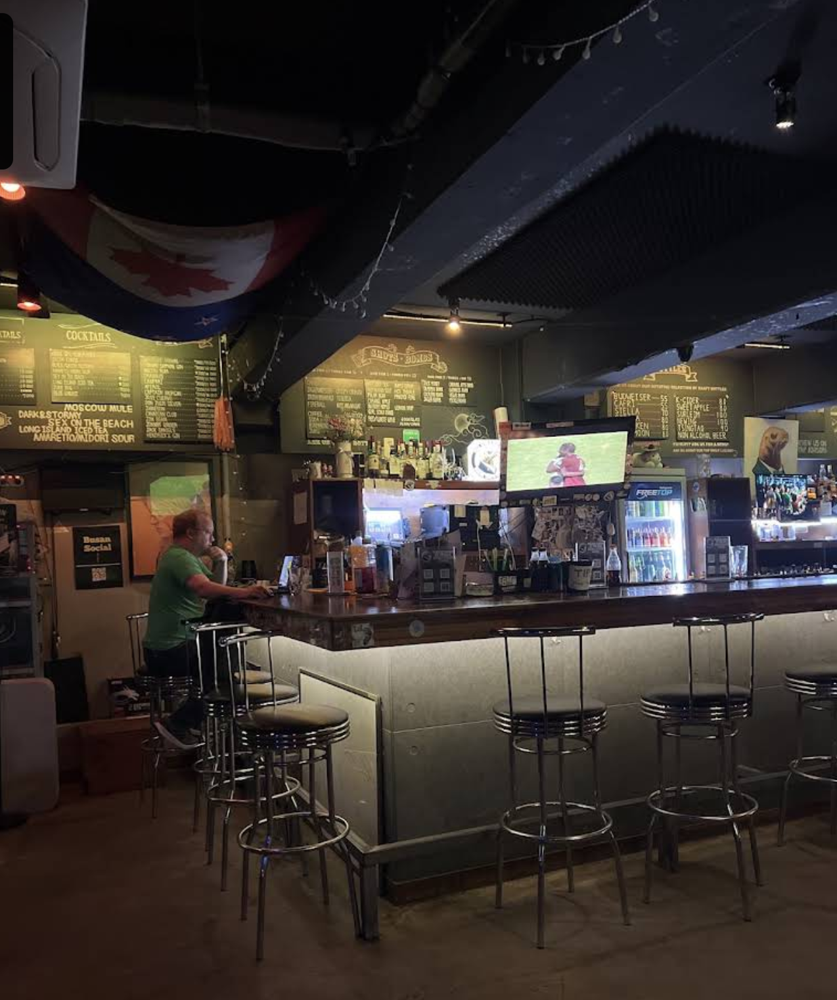
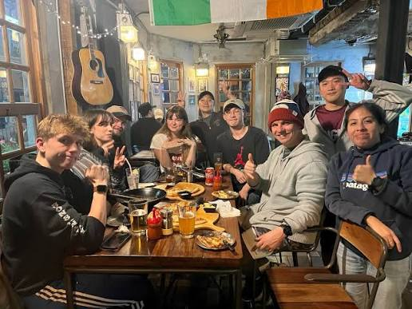
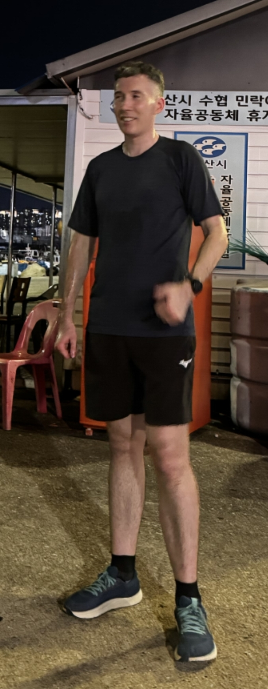

<!-- _class: lead -->

# Guide to Starting a Run Club

---

## Leader

---

## Leader

- LOUD VOICE REQUIRED

---

## Leader

- LOUD VOICE REQUIRED
- Must have some serious credentials

---

## Leader

- LOUD VOICE REQUIRED
- Must have some serious credentials
- Talks about ultramarathons like it's "no big deal"

---

## Leader

- LOUD VOICE REQUIRED
- Must have some serious credentials
- Talks about ultramarathons like it's "no big deal"

> "I haven't done any training and I have an ultramarathon next weekend, I should be fine, right?"

---

## Leader

- LOUD VOICE REQUIRED
- Must have some serious credentials
- Talks about ultramarathons like it's "no big deal"
- Matchmaker on the DL

---

## Venue

- Got to have a venue (where will you go afterwards?)

---

## Venue

- Got to have a venue (where will you go afterwards?)
- In Busan the foreigner run clubs have found a particular niche...

---

---

---

---

## Members — The No Lifer

---

## Members — The No Lifer

- Treats run club purely as a social event

---

## Members — The No Lifer

- Treats run club purely as a social event
- Runs with a partner, but fast! So he can continuously talk (about running), while they have no breath to respond

---

## Members — The No Lifer

- Treats run club purely as a social event
- Runs with a partner, but fast! So he can continuously talk (about running), while they have no breath to respond
- Had already run before coming to run club

---

## Members — The No Lifer

- Treats run club purely as a social event
- Runs with a partner, but fast! So he can continuously talk (about running), while they have no breath to respond
- Had already run before coming to run club
- Constantly sweating

---

## Members — The Girly

---

## Members — The Girly

- Wears the nicest outfits

---

## Members — The Girly

- Wears the nicest outfits
- Organised — she's the reason you get that free beer, because she reminded you to sign the register

---

## Members — The Girly

- Wears the nicest outfits
- Organised — she's the reason you get that free beer, because she reminded you to sign the register
- Might not buy food, but will steal a chip when you're not looking

---

## Members — The Husband

---

## Members — The Husband

- The most approachable guy in the club

---

## Members — The Husband

- The most approachable guy in the club
- Is a low-key hype man

---

## Members — The Husband

- The most approachable guy in the club
- Is a low-key hype man
- Ultimately his wife's ride

---

## Members — The Banner Bearer

---

## Members — The Banner Bearer

- Always appears out of nowhere

---

## Members — The Banner Bearer

- Always appears out of nowhere
- Produces a banner, but nobody has any idea where it came from

---

## Members — The Mother

---

## Members — The Mother

- Always taking care of everyone

---

## Members — The Mother

- Always taking care of everyone
- Talking to newbies and regulars alike to make sure everyone feels included

---

## Members — The Mother

- Always taking care of everyone
- Talking to newbies and regulars alike to make sure everyone feels included
- Signs up to everything — how has she got the time? Doesn't she have like 3 kids?

---

## Members — The Newbie

---

## Members — The Newbie

- Actually comes on time

---

## Members — The Newbie

- Actually comes on time
- Thinks they've come to the wrong place because nobody is there

---

## Members — The Newbie

- Actually comes on time
- Thinks they've come to the wrong place because nobody is there
- Needs moral support to get the beer, seems too good to be true (it's not a prank, John doesn't bite!)

---

## Members — In the Chat but Never Comes

- They say they will come

---

## Members — In the Chat but Never Comes

- They say they will come
- Talking about races in the chat

---

## Members — In the Chat but Never Comes

- They say they will come
- Talking about races in the chat
- But you don't know who this guy is, then he slides into your DMs asking for running advice
